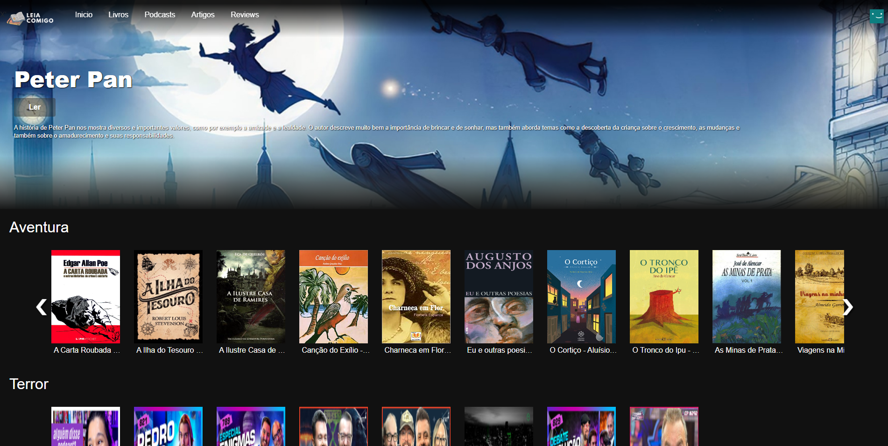
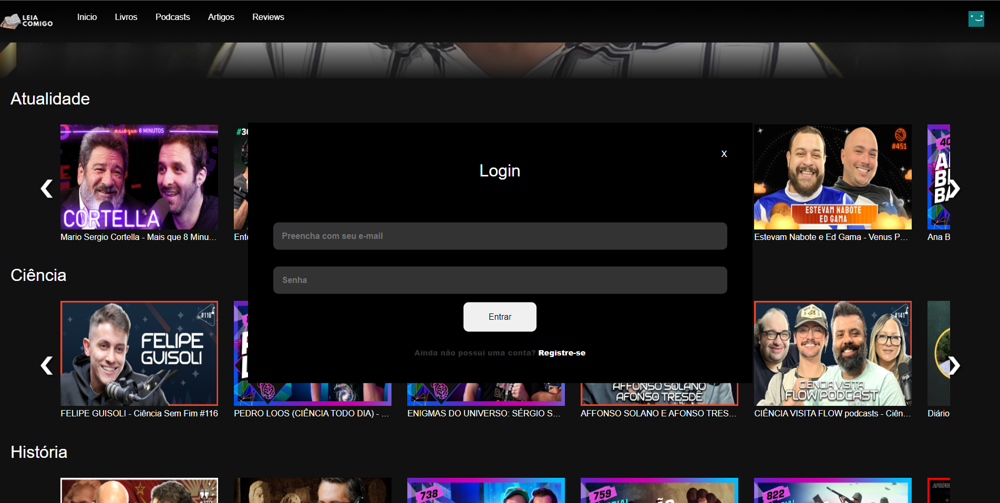
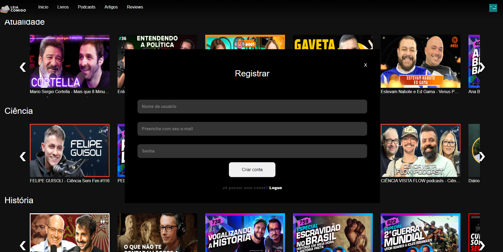

# Programação de Funcionalidades
Nesta seção são apresentadas as telas desenvolvidas para cada uma das funcionalidades do sistema. O respectivo endereço (URL) e outras orientações de acesso são apresentadas na sequência.

# 1.0 Home page 
Nesta página, tela principal do sistema, apresenta um cabeçalho padrão para todas as páginas onde o usuário consegue navegar pelo site. Pelo cabeçalho o usuário pode realizar o fluxo de login como um todo também (login, registro e logout). Apresenta um livro de destaque, e em seguida alguns modais de diversos conteúdos.  A estrutura de dados é toda baseada no modelo JSON.

As telas de consumo de conteúdo acabam atendendo os mesmos requisitos e funcionalidades, mudando apenas os artefatos da funcionalidade.


## 1.1 Requisitios atendidos
- RF-01 O site deve apresentar na página principal uma seleção dinâmica de livros de domínio público obtidos por meio de canais de informações da Internet (API).
- RF-02 O site deve apresentar, para cada livro, uma imagem correspondente à capa do livro apresentado (thumbnail).
- RF-05 O site deve apresentar, para cada livro, uma imagem correspondente à capa do livro apresentado (thumbnail).
- RF-02 o site deve apresentar uma lista de conteúdo correspondente pra cada página, como livros, artivos review, etc;
 
## 1.2 Artefatos da funcionalidade
- index.html
- style.css
- scripts.js
- home.js
- account.js

## 1.3 Estrutura de dados
```javascript
// Estrutura de dados dos livros/podcasts/reviews
{
    id:"books_0",
    type: "books",
    content: "",
    image: "../assets/img/Livros/a_carta_roubada.png",
    description: "A Carta Roubada - Edgar Allan Poe" 
},

```

## 1.4 Instruções de acesso
Abra um navegador de internet e informe a seguinte URL: https://icei-puc-minas-pmv-ads.github.io/pmv-ads-2023-1-e1--proj-web-t8-equipe-leia-comigo/src/pages/


# 2.0 Tela de livros


## 2.1 Artefatos da funcionalidade
- books.html
- books.css
- scripts.js
- books.js
- account.js

## 2.2 Estrutura de dados
```javascript
// Estrutura de dados dos livros/podcasts/reviews
{
    id: "adventures_0",
    type: "adventures",
    image: "https://www.lpm.com.br/livros/imagens/carta_roubada__a_9788525412775_9788525424693_hd.jpg",
    description: "A Carta Roubada - Edgar Allan Poe",
    content: "https://drive.google.com/file/d/1Ei63v5JSx0cYqY6DZhxhcZHjwZot3LuE/preview"
},

```

## 2.3 Instrução de acesso
Abra um navegador de internet e informe a seguinte URL: https://icei-puc-minas-pmv-ads.github.io/pmv-ads-2023-1-e1--proj-web-t8-equipe-leia-comigo/src/pages/Books.html


# 3.0 Login/Registrar
O modal de login permite com que os usuários cadastrados de loguem e consumam qualquer conteúdo da página.

Tela de login


Tela de registro


## 3.1 Requisitos atendidos
- RF-01  O site deve apresentar um fluxo de login com telas, e lógica pra registrar e deslogar

## 3.2 Artefatos da funcionalidade
- account.js
- Todas as páginas da aplicação.

## 3.3 Estrutura de dados 

```javascript
// Estrutura de dados do usuário
{
    name: "",
    password: "",
    email: ""

}
```

## 3.4 Instruções de acesso
Abra um navegador de internet e informe a seguinte URL: https://icei-puc-minas-pmv-ads.github.io/pmv-ads-2023-1-e1--proj-web-t8-equipe-leia-comigo/src/pages/Books.html

Passe o mouse por cima do seu ícone de usuário que fica no cabeçalho da aplicação, e clique em entrar.